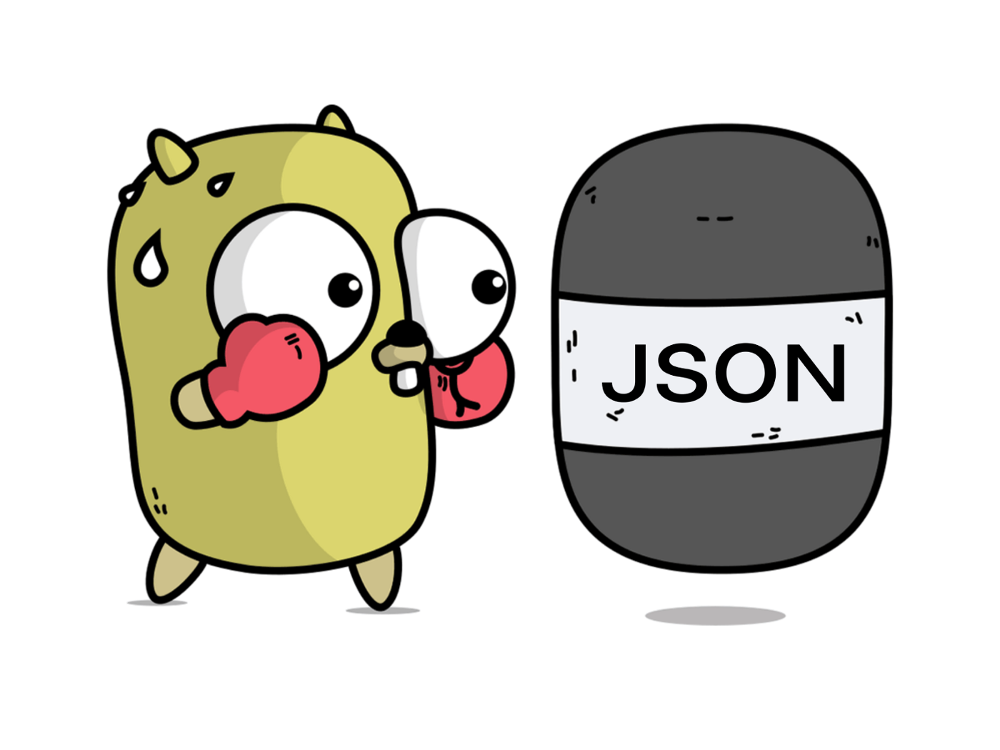

# Handling JSON in Go

<h2>
<a href="https://medium.com/@homayoonalimohammadi/handling-json-in-go-804a1d9bddf5">Link to Medium Post</a>

</h1>

In Go, the encoding/json package offers built-in JSON marshaling and unmarshaling capabilities, allowing us to effortlessly convert Go data structures to JSON and vice versa. However, there are scenarios where the default behavior falls short, such as handling complex data structures, managing custom field names, or dealing with special data types. This article aims to provide an introduction on how JSON can be handled in Go, and as always, with a bit of customization.

- Disclaimer: I tend to make lots of mistakes on a daily basis. If you've noticed one, I'd be more than grateful if you let me know.

